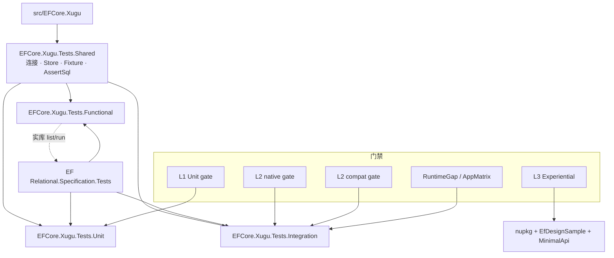

# 测试架构与用例规模

> 汇总视图。操作细节、环境变量与日常命令见 [TESTING.md](TESTING.md)。  
> 统计日期：**2026-07-21**（`dotnet test -c Release --list-tests`，Windows）。

## 1. 概述

Provider 测试按 **L1 Unit → L2 Integration → Spec Functional → L3 Experiential** 分层：

| 层 | 工程 / 形态 | 需要实库 | CI 触发（概要） |
|----|-------------|---------|----------------|
| **L1** | `test/EFCore.Xugu.Tests.Unit` | 否 | 每次 PR / push |
| **L2** | `test/EFCore.Xugu.Tests.Integration` | 是 | main / nightly / `v*`（native + compat 全量） |
| **Spec Functional** | `test/EFCore.Xugu.Tests.Functional` | 是 | 对齐开源 Spec 矩阵（非 PR 强制全量） |
| **L3** | pack + EfDesignSample + MinimalApi 脚本 | 是 | nightly / `v*` |
| **Shared** | `test/EFCore.Xugu.Tests.Shared` | — | 非测试项目（`IsTestProject=false`） |

一句话：**Unit 锁 SQL/类型/服务注册；Integration 锁实库 CRUD/查询/迁移与 Pomelo 对等子集；Functional 继承 EF9 Relational Spec 做大规模查询/批量更新对等；L3 验证 NuGet 消费与设计时路径。**

## 2. 目录结构

```
test/
├── EFCore.Xugu.Tests.Shared/          # 连接、TestStore、Fixture、AssertSql、Northwind 模型
├── EFCore.Xugu.Tests.Unit/            # L1：无库；Baselines/Native/* SQL 金标
├── EFCore.Xugu.Tests.Integration/     # L2：实库；含 Specification/ 子集与 QualityMatrix
├── EFCore.Xugu.Tests.Functional/      # Spec 全量继承：Query/、BulkUpdates/
├── EFCore.Xugu.Tests/README.md        # 旧单体已退役（仅指针）
└── integration-sample/MinimalApi/     # L3 消费方冒烟宿主

harness/scripts/
├── run-unit-gate.ps1                  # L1
├── run-native-gate.ps1 / run-compat-gate.ps1
├── run-integration-gate.ps1           # L2 批处理执行（被 native/compat 调用）
├── run-runtime-gap-gate.ps1           # Category=RuntimeGap
├── run-app-matrix-gate.ps1            # Category=AppCapabilityMatrix
├── run-experiential-gate.ps1          # L3
└── verify.ps1 -RunTests               # L1 + L2 双方言
```

## 3. 分层架构



ASCII 简图：

```
                    ┌─────────────────────────┐
                    │  EF Relational Spec     │
                    │  (NuGet TestBase 库)    │
                    └───────────┬─────────────┘
          inherit/subset        │        inherit W1 suites
         ┌──────────────────────┼──────────────────────┐
         ▼                      ▼                      ▼
   Unit (L1)            Integration (L2)         Functional
   无库 SQL/类型         实库 + Pomelo 对等        Spec 继承展开
         ▲                      ▲                      ▲
         └────────── Shared (连接/Store/金标) ─────────┘
```

### 3.1 Shared

- 连接与 `SkipOrFail`：`XuguTestConnection`
- 表前缀隔离 store：`XuguTestStore*` / `XuguRelationalTestStore*`
- SQL 金标：`TestUtilities/AssertSql.cs`（`SqlAssert`）
- Fixture：`XuguSharedStoreFixture`、`XuguNorthwindQueryFixture`
- 方言测试配置：`XuguDialectTestConfiguration`（`NativeDialect` 等 Category）

### 3.2 L1 Unit

- SQL 金标：`NativeSqlBaselineTests` + `Baselines/Native/*`
- TypeMapping / Migration SQL / TranslatorSql / UpdateSqlGenerator
- NotSupported 消息矩阵、Options、Retry 检测、API consistency
- **门禁下限**：`--list-tests` ≥ **250**（`run-unit-gate.ps1`）

### 3.3 L2 Integration

- 实库 CRUD、Northwind Query、Migrations、JSON、并发 token、Spec 子集等
- 方言矩阵：`Xugu_DIALECT_MODE=native|compat`（双方言均为**全量**套件）
- QualityMatrix / RuntimeGap / AppCapabilityMatrix / Cluster 等 Trait 子集
- `XUGU_REQUIRE_DATABASE=true` 时库不可达 = **FAIL**（非 Skip）
- 串行：`DisableTestParallelization`；gate 按类分批跑（缓解驱动连接泄漏）
- **门禁下限**：`--list-tests` ≥ **850**

### 3.4 Spec Functional

- 继承 `Microsoft.EntityFrameworkCore.Relational.Specification.Tests` 的 `*TestBase`
- 对照：[Xugu-Open-Source/efcore](https://github.com/Xugu-Open-Source/efcore) `v8.0.0-xugu` FunctionalTests；设计见 `docs/superpowers/specs/2026-07-21-spec-matrix-alignment-design.md`
- W1 套件：NullSemantics、GearsOfWar(+TPT/TPC)、ComplexNavigations、Owned、PrimitiveCollections、TPC Inheritance Query、BulkUpdates
- 共享 SYSTEM + 表前缀（非 `CREATE DATABASE`）；Wave1 以**结果断言**为主，AssertSql 多 deferred

### 3.5 L3 Experiential

非 xUnit 列测套件，脚本路径：

1. `publish-nuget.ps1 -Pack`
2. 临时工程 PackageReference 消费 + `CanConnect`
3. `samples/EfDesignSample`：`dotnet ef migrations list` + `database update`
4. `test/integration-sample` MinimalApi HTTP 冒烟

## 4. 用例规模统计

### 4.1 统计口径

| 口径 | 含义 | 适用 |
|------|------|------|
| **discovered** | `dotnet test --list-tests` 展开后的用例行（含 Theory/`InlineData` 参数行） | **主口径**；门禁冻结也基于 list-tests |
| **源属性** | 本仓库 `.cs` 中 `[Fact]`/`[Theory]`/`[SkippableFact]`/`[SkippableTheory]`/`[ConditionalFact]` 出现次数 | 次优；**不含**从 Spec 基类继承的方法 |
| **源文件数** | 测试 `.cs` 文件数（含 Fixture/辅助） | 仅看体量，**不等于**用例数 |

说明：

- Functional 本地属性很少（~20），但发现用例 **8500+**，因方法在 Spec 基类中，经继承 + Theory 展开后由 VSTest 发现。
- 门禁脚本用 `Select-String '^\s+[A-Za-z]'` 计数，会把约 **3** 行构建输出（如 `EFCore.Xugu.Tests.* -> ...dll`）一并计入；下表 **discovered** 已按 `Microsoft.EntityFrameworkCore.*` FQN 过滤，更接近真实用例数。
- Integration 历史冻结文档（`test-parity-matrix.md`）曾记 compat **1057**；当前工程拆分/演进后以本次实测为准。

### 4.2 主表（discovered）

| 项目 | discovered | 测试类（约） | 源 `.cs` | 源属性（约） | 实库 |
|------|-----------|-------------|----------|-------------|------|
| **Unit** | **281** | 26 | ~27 | ~200 | 否 |
| **Integration** | **912** | 99 | ~126 | ~767 | 是 |
| **Functional** | **8538** | 29 | ~52 | ~20（本地） | 是 |
| **Shared** | 0 | — | ~23 | 0 | — |
| **合计（xUnit）** | **9731** | — | — | — | — |
| **L3 Experiential** | 非列测（脚本冒烟） | — | — | — | 是 |

复算命令：

```powershell
dotnet test test/EFCore.Xugu.Tests.Unit -c Release --list-tests
dotnet test test/EFCore.Xugu.Tests.Integration -c Release --list-tests
dotnet test test/EFCore.Xugu.Tests.Functional -c Release --list-tests
# 计数示例：输出中匹配 ^\s+Microsoft\.EntityFrameworkCore 的行数
```

### 4.3 Functional 内部分布（discovered）

| 命名空间前缀 | 用例数 |
|--------------|--------|
| `...FunctionalTests.Query` | **8098** |
| `...FunctionalTests.BulkUpdates` | **440** |
| **合计** | **8538** |

较大类（示意）：`GearsOfWarQueryXuguTest` ~1347；`TPCGearsOfWarQueryXuguTest` / `TPTGearsOfWarQueryXuguTest` 各 ~1331；`ComplexNavigations*` 系列数百至六百级；`NullSemanticsQueryXuguTest` ~321；`NorthwindBulkUpdatesXuguTest` ~170。

### 4.4 门禁下限 vs 当前

| 项目 | 冻结下限 | 当前 discovered |
|------|---------|-----------------|
| Unit | ≥ 250 | **281** |
| Integration | ≥ 850 | **912** |
| Functional | （无 list-tests 下限） | **8538** |

## 5. 用例来源

| 来源 | 落点 | 说明 |
|------|------|------|
| **自写** | Unit 为主；Integration 部分 | SQL 金标、TypeMapping、NotSupported、Retry、方言烟测、QualityMatrix 等 |
| **Pomelo 对等** | Integration | 目录/类命名对齐 Pomelo FunctionalTests 子集；矩阵与 Adjusted 覆盖率见 `harness/references/test-parity-matrix.md`（Phase 12 冻结叙事） |
| **EF Relational Spec** | Functional（主）；Integration `Specification/` 子集 | 继承 `*TestBase`；Functional W1 对齐开源 Xugu FunctionalTests |
| **L3 消费路径** | 脚本 + samples / integration-sample | 验证 pack、dotnet-ef、MinimalApi，非 Spec 继承 |

三类绿验收（Translator / 应用路径）：**SQL 形状**（Unit）+ **服务端执行**（Integration）+ **客户端物化**（Integration / RuntimeGap），见 [TESTING.md](TESTING.md)。

## 6. 如何运行

```powershell
# L1（无库）
harness/scripts/run-unit-gate.ps1 -Configuration Release
# 或
dotnet test test/EFCore.Xugu.Tests.Unit -c Release

# L2（需 XuguDB；gate 会设 XUGU_REQUIRE_DATABASE=true）
harness/scripts/run-native-gate.ps1 -Configuration Release -MaxAttempts 3
harness/scripts/run-compat-gate.ps1 -Configuration Release -MaxAttempts 3
# 或 verify：L1 + L2 双方言
harness/scripts/verify.ps1 -RunTests

# Functional（需实库；建议按套件过滤）
$env:XUGU_DIALECT_MODE = 'native'
$env:XUGU_REQUIRE_DATABASE = 'true'
dotnet test test/EFCore.Xugu.Tests.Functional -c Release --filter "FullyQualifiedName~NullSemantics"

# L3（需实库 + dotnet-ef）
harness/scripts/run-experiential-gate.ps1 -Configuration Release
```

默认连接：`IP=127.0.0.1; ... PORT=5138 ...`（可用 `XUGU_CONNECTION_STRING` 覆盖）。启动库：`harness/scripts/start-xugudb.ps1`。

## 7. 门禁与 CI

| Gate | 脚本 | 要点 |
|------|------|------|
| L1 | `run-unit-gate.ps1` | list-tests ≥ 250，然后全量 Unit |
| L2 native / compat | `run-native-gate.ps1` / `run-compat-gate.ps1` | 经 `run-integration-gate.ps1`：list-tests ≥ 850；按类分批；`REQUIRE_DATABASE` |
| RuntimeGap | `run-runtime-gap-gate.ps1` | Category=`RuntimeGap` |
| AppMatrix | `run-app-matrix-gate.ps1` | Category=`AppCapabilityMatrix`；native+compat |
| L3 | `run-experiential-gate.ps1` | pack + ef + MinimalApi |

CI：L1 = 所有 PR/push；L2 = main / schedule / `v*`；L3 = schedule / `v*`。实库目前 **Windows-only**（Linux RID：`libxugusql.so` 缺失，见 LIMITATIONS / PLAT-02）。

## 8. 已知限制与环境依赖

| 项 | 说明 |
|----|------|
| XuguDB | L2 / Functional / L3 必需；默认 `127.0.0.1:5138` |
| 原生驱动 | Integration / Functional 构建复制 `xugusql.dll` |
| `XUGU_REQUIRE_DATABASE` | gate 设为 `true`：不可达失败；本地未设时 Integration 可 Skip |
| 集群用例 | `Category=Cluster` 需 `XUGU_CLUSTER_PORTS` |
| Functional 规模 | 全量 ~8500+，宜按套件过滤；共享 SYSTEM + 表前缀 |
| Spec AssertSql | Wave1 多 deferred，以结果正确优先 |
| 旧单体 | `test/EFCore.Xugu.Tests` 已退役 |
| Pomelo IntegrationTests | ASP.NET+性能宿主，**未**对等移植（低价值，见 parity 矩阵 9.IT） |

## 9. 相关文档

| 文档 | 用途 |
|------|------|
| [TESTING.md](TESTING.md) | 日常命令、环境变量、QualityMatrix、三类绿 |
| `harness/skills/provider-testing/SKILL.md` | Agent 测试模块技能 |
| `harness/references/test-parity-matrix.md` | Phase 9–12 Pomelo 对等与冻结数字（历史） |
| `docs/superpowers/specs/2026-07-21-spec-matrix-alignment-design.md` | Functional Spec 对齐设计 |
| [LIMITATIONS.md](LIMITATIONS.md) | 产品/平台限制 |
